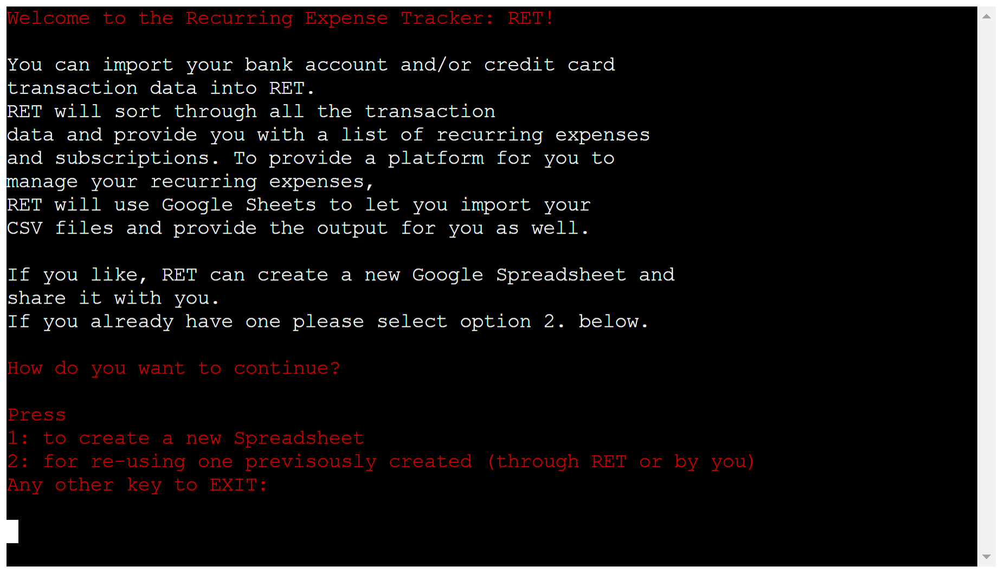
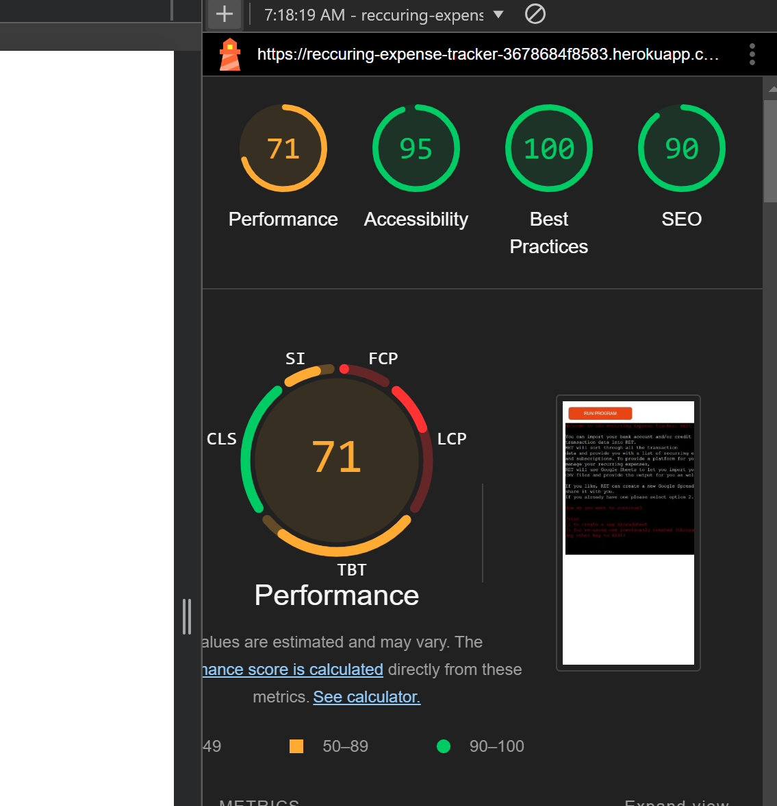
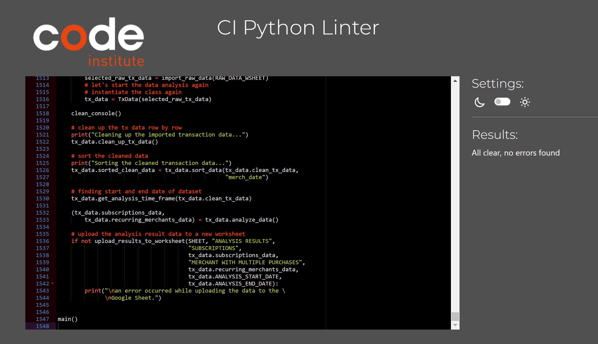

# RECURRING EXPENSE TRACKER
This is an app to identify recurring expenses in your credit cards or accounts: Recurring Expense Tracker (RET): [Recurring Expense Tracker](https://reccuring-expense-tracker-3678684f8583.herokuapp.com/). 
 

I was inspired to implement this app as it got very cumbersome to sort through all credit card statements and accounts to find all recurring expenses / subscriptions. I also did not want to give external services direct access to my accounts. This app works on imported CSV files with the respective transaction data. To make it easy for the user to maintain the list of subsrcriptions and recurring purchases and merchants RET uses Google Sheets.

The us can let RET create a spreadsheet and share it with the user or the user can create his/her own sheet and share it with RET.

RET performs data conversion if necessary in regards to date format and amount format. If more then 10% error occur, RET will notify the user and ask the user to select the dataset again.

The result of the analysis will be provided in a new worksheet with the default name "ANALYSIS RESULTS". If that sheet already exist the user can select a new name. 

## User Experience

### Target Audience:
    anybody who wants to analysis his expenes for recurring purchases and subscriptions. 

### User Stories:
    (1) as a user I want to import my transaction data from a csv file
    (2) as user I want to have RET create a blank new spreadsheet 
    (3) as a user I want to use my existing spreadsheet
    (4) as a user I want to tell RET where my relevant transaction data starts
    (5) as a user I want to tell RET in what columns my transaction date, merchant and amount is
    (6) as a user I want to see a list of all subscriptions incl. their monthly, quarterly amounts
    (7) as a user I want to see my overall spend for a given subscription
    (8) as a user I want to see a list of recurring merchant and how often I shopped there and how much I spend
    (9) as a user I want to be able to select a different dataset if there were to many errors or I made a mistake in selectin wrong columns etc.
    
### Future Use-Cases
    (9) asking the user to add data from another source before starting the analysis
    (10) more output data (e.g. list of individual purchases at recurring merchants)
    (11) collect agregated subscription info from all user (in line with GDPR) to provide insights to other users on avergae paid subscriptions etc.
  

## Design
### Site Structure
The site uses the CI terminal emulator for python CL applications 

### Program Flow

### Color Scheme
Black and white with highlight colors in terminal window.
        
## Current Features:

### Landing Page
The landing page is the core of the Love-To-Learn Site. It shows everything the user needs to get started with the learning experience.
 

- __Username__
To make the experience personal L2L asks the users for their Name or Alias. 
 
 

If the user decides not to fill in any data, L2L selects a default:
 

- __Exercise Book Details__
This area shows the Name of the Exercise Book, the current topic within the Exercise Book and the languages to be learned.
 

### Word Card
- __Results Area__
The results of the current learning session is presented below the Word Card:
 

### Navigation Bar
The Navigation Bar provides buttons to manage Exercise Books and acces to the Help/Info function.
 

- __Info Button__
The Info Button displays info on each of the buttons of the L2L Site.  One click on the Info Button will show the Info/Help text for each of the main site elements. When pressed again the info will disappear again. 

 

- __Save Exercise Book__
 

 
At any time, the user can save the current Exercise Book. The browser treats this as a file download and on mobile it is typically saved to the DOWNLOADS directory by default.
(on mobiles it typically is saved to the DOWNLOADS directory by default)
 

- __Download Template__
 

 

To make it easy to build your own Exercise Book, L2L provides a template download function. Save the file at a destination of your choice (on mobiles it typically is saved to the DOWNLOADS directory by default). The user can open the file in a text editor or spreadsheet program to manually enter word pairs.
The Load Exercise Book function allows the loading of the downloaded template into L2L and the user can use the L2L __Add Card__ function to add words as desired.

- __Load Exercise Book__
 

Users can load their existing (or previously saved) Exercise Books into L2L to start learning right away.

### Learning Mode
The core of L2L is to help user learn vocabulary. After loading an existing Exercise Book or manually entering a desired vocabulary the users can get start to learn and test their knowledge and progress.

- __Navigating the Exercise Book__
 

 

The top of the front of the Word Card has buttons to step forward (Next Button) or backward (Previous Button) in the current Exercise Book and shows the current position in the Exercise Book. The Front also shows the original word to be learned.

- __Learning and testing your knowledge__
To learn the card, the user clicks on the flip card button and can press on the magnifying glass to display the translation of the original word.
 

 

- __Verifying your Result - correct__
Once the user has mastered the word, they can either type in the translation in to the input field and press ENTER (or the Enter button). If the translation was correct, the card will turn green and the 'got it' counter increases. 

- __Verifying your Result - incorrect__
If the translation was wrong the card turns red and the 'to improve' counter increases.

The user can also keep the translation in mind and just click on the magnifying glass to see if they were right. If they were correct, they can press the correct button below the input field. The card will turn green and the 'got it' counter increases. If they were wrong they can press the x-button below the input field and the card turns red and the 'to improve' counter increases.

The user can also flip back to the front and look at the original word again.

### Add a Word Card
 

 

The user can manually add words to the current Exercise Book or start a new Exercise Book from scratch. To add words, the users clicks on the + Button on the front of the word card. When hitting Enter or clicking on flip-card, the card will turn to the backside and the user can enter the translation. L2L will save the card once the user hits Enter, clicks the Enter-Button or the Correct-Button below the input field for the translated word. Automatically the card will flip to the front to get back into learning mode.

### Delete current Word Card
The user can delete a card in the current Exercise Book by clicking on the trash button below the original word on the front of the card. A confirm/Cancel message will pop up and the card will be deleted.
 

 

## Manual Testing

__Various Browsers on desktop devices:__
| Nr | Feature              | Action                                                                                     | Expected Behaviour                                                                                                                                                                   | desktop- chrome | desktop- firefox |
| -- | -------------------- | ------------------------------------------------------------------------------------------ | ------------------------------------------------------------------------------------------------------------------------------------------------------------------------------------ | --------------- | ---------------- |
| 1  | new spreadsheet      | enter something that is not an email address                                               | check if value entered is an email                                                                                                                                                   | ok              | ok               |
| 2  | new spreadsheet      | enter valid email                                                                          | RET informs you that a spreadsheet has been created and shares the URL for it                                                                                                        | ok              | ok               |
| 3  | new spreadsheet      | check if en email from Google with the shared spreadsheet has arrived                      | email with link to shared spreadsheet has arrived                                                                                                                                    | ok              | ok               |
| 4  | new spreadsheet      | copy/past link to browser window                                                           | shared spreadsheet opens                                                                                                                                                             | ok              | ok               |
| 5  | new spreadsheet      | enter n when asked if you opened the spreadsheet                                           | RET should repeat the question                                                                                                                                                       | ok              | ok               |
| 6  | import data          | enter n when asked if you imported csv data                                                | RET should repeat the question                                                                                                                                                       | ok              | ok               |
| 7  | import data          | enter wrong sheet name when asked for the sheet name of the csv import                     | RET return an error and ask for the correct name again                                                                                                                               | ok              | ok               |
| 8  | import data          | enter correct sheet name                                                                   | RET will start the data import with a series of questions                                                                                                                            | ok              | ok               |
| 9  | import data          | enter non numerical value for starting row                                                 | RET will return an error and ask for a numerical value                                                                                                                               | ok              | ok               |
| 10 | import data          | enter a non letter (e.g. numerical) value for date column                                  | RET will return an error and ask for a letter value                                                                                                                                  | ok              | ok               |
| 11 | import data          | enter a non letter (e.g. numerical) value for merchantg column                             | RET will return an error and ask for a letter value                                                                                                                                  | ok              | ok               |
| 12 | import data          | enter a non letter (e.g. numerical) value for amount column                                | RET will return an error and ask for a letter value                                                                                                                                  | ok              | ok               |
| 13 | import data          | when presented with the sample data is ok, enter 'n'                                       | RET will ask you to start entering the start row and data columns questions again                                                                                                    | ok              | ok               |
| 14 | import data          | when presented with the sample data is ok, enter 'y' even though the data is clearly wrong | RET returns an error that the data contains to much errors and terminates the program                                                                                                | ok              | ok               |
| 15 | import data          | using data that has more than 10% errors in the date or amount column                      | RET will inform the unser that to many errors where found and ask if he/she wants to try again                                                                                       | ok              | ok               |
| 16 | upload results       | when ask for a new name for the analysis results enter an existing name                    | when RET detects that a worksheet with the default name 'ANALYSIS RESULT' or the name you enterd already exists it will ask you to enter a new name until you provided a unique name | ok              | ok               |
| 17 | existing spreadsheet | enter wrong URL                                                                            | RET will inform you that it couldn't find the spreadsheet and asks to copy the URL for the spreadsheet                                                                               | ok              | ok               |
| 18 | existing spreadsheet | enter the URL to an existing Google spreadsheet that has not been shared with RET          | RET will inform you that it has no access rights to the sheet and asks you to copy the RET user name and share the spreadsheet with that user                                        | ok              | ok               |
| 19 | existing spreadsheet | after sharing copy the URL again                                                           | RET will inform you that it could establish access to the spreadsheet and ask for the worksheet name where the CSV data is located                                                   | ok              | ok               |

### Open/Known Issues
__Merge manual Cards when loading new Exercise Book:__

    (1) Line break when user is asked for date, merchant and amount columns

## Code Validation
### lighthouse
__Results:__
Lighouse test results.
 

 

#### CI Python Linter
CI Python Linter test results:
 

 

## Deployment
This section should describe the process you went through to deploy the project to a hosting platform (e.g. GitHub) 

The app is deployed via Heroku.
When you create the app, you will need to add two buildpacks from the _Settings_ tab. The ordering is as follows:

1. `heroku/python`
2. `heroku/nodejs`

To set the credentials for Google Services create another _Config Var_ called `CREDS` and paste the JSON into the value field.

The live link can be found here: https://reccuring-expense-tracker-3678684f8583.herokuapp.com/

## Credits
### Tutorials
no tutorials were used.

### Code
W3Schools: https://www.w3schools.com/
MDN Web Docs: https://developer.mozilla.org/en-US/
GeeksForGeeks: https://www.geeksforgeeks.org/
               https://www.geeksforgeeks.org/python-validate-string-date-format/
               https://www.geeksforgeeks.org/python-output-formatting/
python.org: https://docs.python.org/3/tutorial/errors.html:
Sololearn: https://www.sololearn.com/en/Discuss/3220821/how-how-to-delete-printed-text
pyt5on.org: https://docs.python.org/3/tutorial/datastructures.html
askpython: https://www.askpython.com/python/examples/find-number-of-days-in-month
finxter: https://blog.finxter.com/5-effective-ways-to-check-if-a-string-can-be-converted-to-a-datetime-in-python/
GSPREAD Docs: https://docs.gspread.org/en/latest/user-guide.html#creating-a-worksheet
Pypi: https://pypi.org/project/gspread-formatting/

Github Copilot provided the core of following functions:

    (1)  the upload/import of an existing .CSV file (incl. handleFileSelect(), csvToArray() )
    (2)  the 3D flip card design and animation (incl. respective code in DOMContentLoaded EventListner)
    (3)  drawDividerBack(), drawDividerFront()
    (4)  the convert array to CSV conversion: convertArrayToCSV()
    (5)  basic structure of editH2Content() (especially the ***.childNodes[0].nodeValue solution)
    (6)  the basic structure idea of a modal dialog of the greetUser() function 

I used https://tabletomarkdown.com/convert-spreadsheet-to-markdown/ to convert my Google Sheets manual testing matrix into a to table for this readme.

### Graphics
icons: https://fontawesome.com/
favicon: https://www.freepik.com/icon

### Photos

### Any other resources
https://validator.w3.org/nu/#textarea
https://jigsaw.w3.org/css-validator/validator

## Creating the Heroku app

When you create the app, you will need to add two buildpacks from the _Settings_ tab. The ordering is as follows:

1. `heroku/python`
2. `heroku/nodejs`

You must then create a _Config Var_ called `PORT`. Set this to `8000`

If you have credentials, such as in the Love Sandwiches project, you must create another _Config Var_ called `CREDS` and paste the JSON into the value field.

Connect your GitHub repository and deploy as normal.
