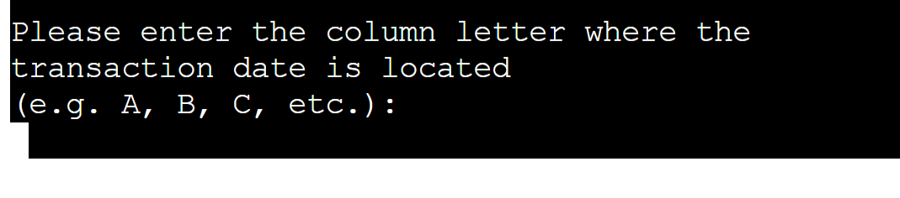
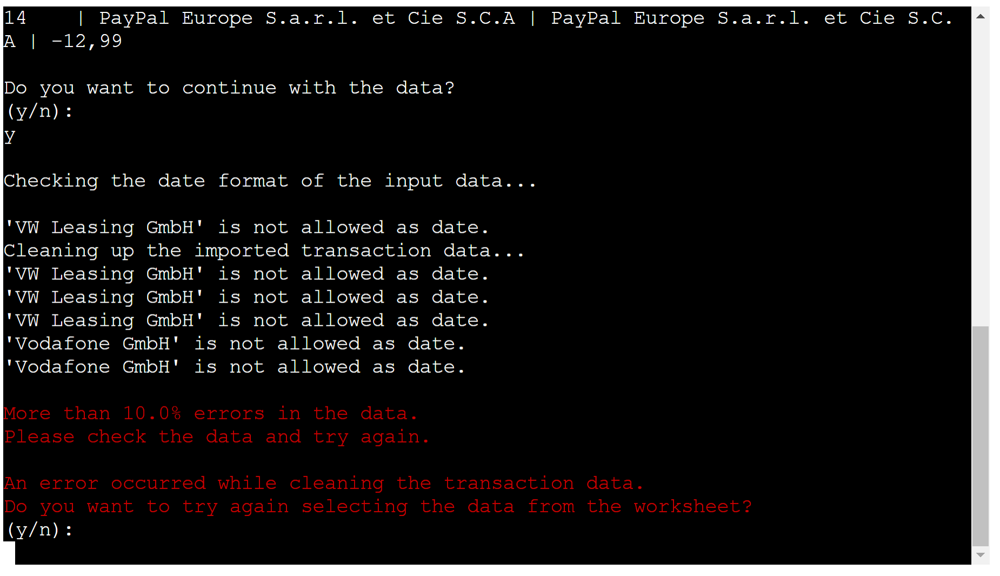

# RECURRING EXPENSE TRACKER
This is an app to identify recurring expenses in your credit cards or accounts: Recurring Expense Tracker (RET): [Recurring Expense Tracker](https://reccuring-expense-tracker-3678684f8583.herokuapp.com/). 
 

I was inspired to implement this app as it got very cumbersome to sort through all credit card statements and accounts to find all recurring expenses / subscriptions in the attempt to better manage my finances and find areas to save money. I also did not want to give external services direct access to my accounts. 

This app works on imported CSV files with the respective transaction data. To make it easy for the user to maintain the list of subsrcriptions and recurring purchases and merchants RET uses Google Sheets.

To make RET flexible, it supports creating a new spreadsheet and share it with the user as well as allowing the user to create his/her own sheet and share it with RET.

To provide some level of error resistance, RET performs data conversion if necessary in regards to date format and amount format. If more then 10% error occur, RET will notify the user and ask the user to select the dataset again.

The result of the analysis will be provided in a new worksheet with the default name "ANALYSIS RESULTS". If that sheet already exist the user can select a new name. 

## User Experience

### Target Audience:
    anybody who wants to analyze his expenes for recurring purchases and subscriptions. 

### User Stories:
    (1) as a user I want to import my transaction data from a csv file
    (2) as user I want to have RET create a blank new spreadsheet 
    (3) as a user I want to use my existing spreadsheet
    (4) as a user I want to tell RET where my relevant transaction data starts
    (5) as a user I want to tell RET in what columns my transaction date, merchant and amount is
    (6) as a user I want to see a list of all subscriptions incl. their monthly, quarterly amounts
    (7) as a user I want to see my overall spend for a given subscription
    (8) as a user I want to see a list of recurring merchant and how often I shopped there and how much I spend
    (9) as a user I want to be able to select a different dataset if there were to many errors or I made a mistake in selectin wrong columns etc.
    
### Future Use-Cases
    (9) asking the user to add data from another source before starting the analysis
    (10) more output data (e.g. list of individual purchases at recurring merchants)
    (11) collect agregated subscription info from all user (in line with GDPR) to provide insights to other users on avergae paid subscriptions etc.
  

## Design
### Site Structure
The site uses the Code Institute terminal emulator for python CL applications 

### Program Flow

- __Main Menue__

- __Create new Spreadsheet__

- __Use an existing spreadsheet__

- __Upload transaction data__

- __Error handling - transaction data upload__

- __Providing analysis results__

- __Error handling - providing analysis results__

### Color Scheme
Black and white with highlight colors in terminal window.

## Manual Testing

__Various Browsers on desktop devices:__
| Nr | Feature              | Action                                                                                     | Expected Behaviour                                                                                                                                                                   | desktop- chrome | desktop- firefox |
| -- | -------------------- | ------------------------------------------------------------------------------------------ | ------------------------------------------------------------------------------------------------------------------------------------------------------------------------------------ | --------------- | ---------------- |
| 1  | new spreadsheet      | enter something that is not an email address                                               | check if value entered is an email                                                                                                                                                   | ok              | ok               |
| 2  | new spreadsheet      | enter valid email                                                                          | RET informs you that a spreadsheet has been created and shares the URL for it                                                                                                        | ok              | ok               |
| 3  | new spreadsheet      | check if en email from Google with the shared spreadsheet has arrived                      | email with link to shared spreadsheet has arrived                                                                                                                                    | ok              | ok               |
| 4  | new spreadsheet      | copy/past link to browser window                                                           | shared spreadsheet opens                                                                                                                                                             | ok              | ok               |
| 5  | new spreadsheet      | enter n when asked if you opened the spreadsheet                                           | RET should repeat the question                                                                                                                                                       | ok              | ok               |
| 6  | import data          | enter n when asked if you imported csv data                                                | RET should repeat the question                                                                                                                                                       | ok              | ok               |
| 7  | import data          | enter wrong sheet name when asked for the sheet name of the csv import                     | RET return an error and ask for the correct name again                                                                                                                               | ok              | ok               |
| 8  | import data          | enter correct sheet name                                                                   | RET will start the data import with a series of questions                                                                                                                            | ok              | ok               |
| 9  | import data          | enter non numerical value for starting row                                                 | RET will return an error and ask for a numerical value                                                                                                                               | ok              | ok               |
| 10 | import data          | enter a non letter (e.g. numerical) value for date column                                  | RET will return an error and ask for a letter value                                                                                                                                  | ok              | ok               |
| 11 | import data          | enter a non letter (e.g. numerical) value for merchantg column                             | RET will return an error and ask for a letter value                                                                                                                                  | ok              | ok               |
| 12 | import data          | enter a non letter (e.g. numerical) value for amount column                                | RET will return an error and ask for a letter value                                                                                                                                  | ok              | ok               |
| 13 | import data          | when presented with the sample data is ok, enter 'n'                                       | RET will ask you to start entering the start row and data columns questions again                                                                                                    | ok              | ok               |
| 14 | import data          | when presented with the sample data is ok, enter 'y' even though the data is clearly wrong | RET returns an error that the data contains to much errors and terminates the program                                                                                                | ok              | ok               |
| 15 | import data          | using data that has more than 10% errors in the date or amount column                      | RET will inform the unser that to many errors where found and ask if he/she wants to try again                                                                                       | ok              | ok               |
| 16 | upload results       | when ask for a new name for the analysis results enter an existing name                    | when RET detects that a worksheet with the default name 'ANALYSIS RESULT' or the name you enterd already exists it will ask you to enter a new name until you provided a unique name | ok              | ok               |
| 17 | existing spreadsheet | enter wrong URL                                                                            | RET will inform you that it couldn't find the spreadsheet and asks to copy the URL for the spreadsheet                                                                               | ok              | ok               |
| 18 | existing spreadsheet | enter the URL to an existing Google spreadsheet that has not been shared with RET          | RET will inform you that it has no access rights to the sheet and asks you to copy the RET user name and share the spreadsheet with that user                                        | ok              | ok               |
| 19 | existing spreadsheet | after sharing copy the URL again                                                           | RET will inform you that it could establish access to the spreadsheet and ask for the worksheet name where the CSV data is located                                                   | ok              | ok               |

### Open/Known Issues

    (1) Line break when user is asked for date, merchant and amount columns

## Code Validation
### lighthouse
__Results:__
Lighouse test results.
 

 

#### CI Python Linter
CI Python Linter test results:
 

 

## Deployment
This section should describe the process you went through to deploy the project to a hosting platform (e.g. GitHub) 

The app is deployed via Heroku.
When you create the app, you will need to add two buildpacks from the _Settings_ tab. The ordering is as follows:

1. `heroku/python`
2. `heroku/nodejs`

To set the credentials for Google Services create another _Config Var_ called `CREDS` and paste the JSON into the value field.

The live link can be found here: https://reccuring-expense-tracker-3678684f8583.herokuapp.com/

## Credits
### Tutorials
no tutorials were used.

### Code
W3Schools:      https://www.w3schools.com/
MDN Web Docs:   https://developer.mozilla.org/en-US/
GeeksForGeeks:  https://www.geeksforgeeks.org/
                https://www.geeksforgeeks.org/python-validate-string-date-format/
                https://www.geeksforgeeks.org/python-output-formatting/
python.org:     https://docs.python.org/3/tutorial/errors.html:
Sololearn:      https://www.sololearn.com/en/Discuss/3220821/how-how-to-delete-printed-text
pyt5on.org:     https://docs.python.org/3/tutorial/datastructures.html
askpython:      https://www.askpython.com/python/examples/find-number-of-days-in-month
finxter:        https://blog.finxter.com/5-effective-ways-to-check-if-a-string-can-be-converted-to-a-datetime-in-python/
GSPREAD Docs:   https://docs.gspread.org/en/latest/user-guide.html#creating-a-worksheet
Pypi:           https://pypi.org/project/gspread-formatting/

Github Copilot or ChatGPT provided the core or parts of following functions/methods:

    (1)  validate_email(email)
    (2)  format_row_in_worksheet(worksheet, row, type)
    (3)  check_date_format(self, data)
    (4)  clean_date(self, date_str)
    (5)  clean_amount(self, amount_str)
    (6)  format_row_in_worksheet(worksheet, row, type) 

I used https://tabletomarkdown.com/convert-spreadsheet-to-markdown/ to convert my Google Sheets manual testing matrix into a to table for this readme.

